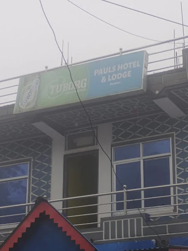
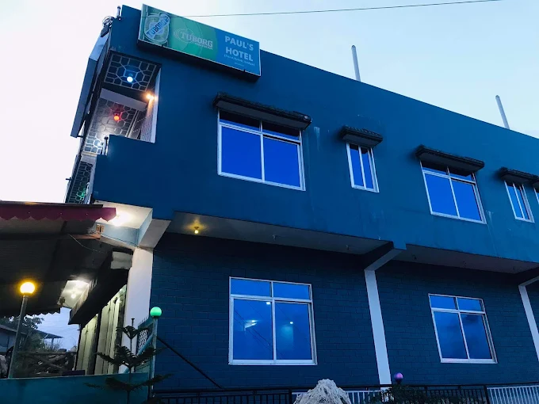
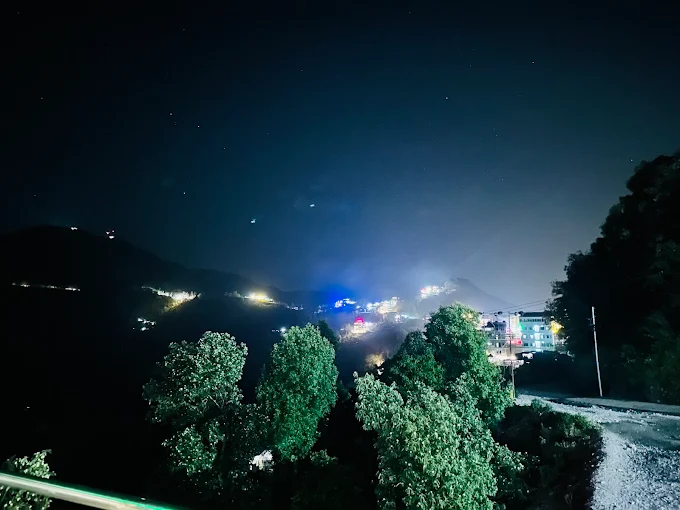
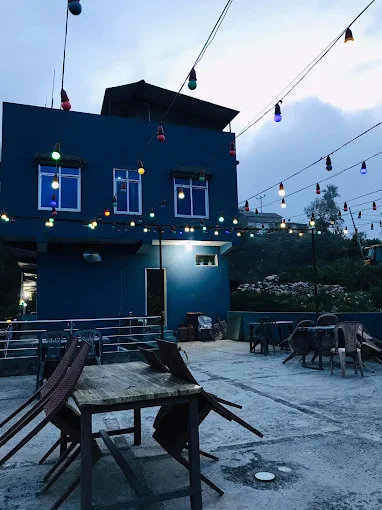
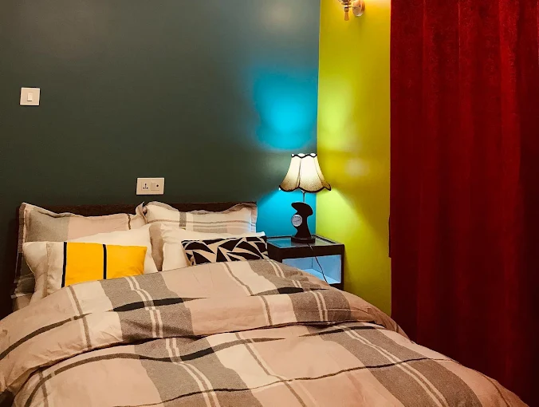
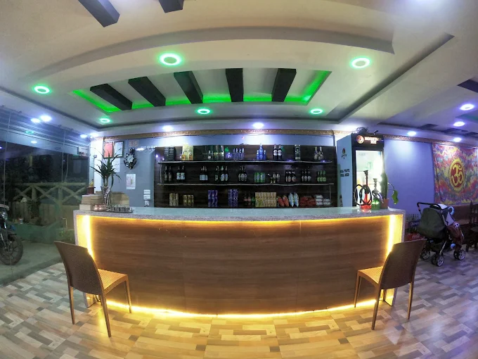
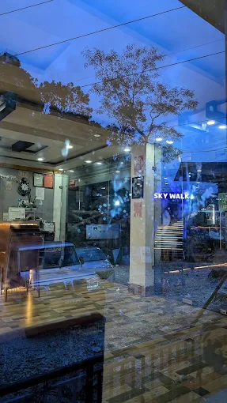

<div align="center">



# 🏔️ Paul's Hotel &amp; Lodge — Bhedetar

### A hilltop hotel website that ranks, converts, and runs itself.

Production marketing site **+** owner admin panel for a real hotel at Charles Point,
Bhedetar (Dhankuta, Nepal). Built to win local search, look premium on every device,
and let the owner run the whole site — blog, gallery, and guest enquiries — without a developer.

<br/>

[](https://hotelpauls.com)
&nbsp;
[](https://hotelpauls.com)

<br/>


</div>

---

## ✨ The vibe

> Deep hotel-blue, warm string-light amber, soft hill-resort neutrals. Slow Ken-Burns
> hero carousels, alternating scroll reveals, parallax over the valley, an auto-scrolling
> food marquee — all `prefers-reduced-motion` aware. Built to feel like the place, not like a template.

<div align="center">

| | | |
|:--:|:--:|:--:|
|  |  |  |
| **Exterior, blue dusk** | **Valley city-lights** | **String-light terrace** |
|  |  |  |
| **Deluxe double** | **LED bar lounge** | **Sky Walk lounge** |

</div>

---

## 🚀 What it does

- **Marketing site** — Home, Rooms, Dining, Gallery, Experiences, Blog, Contact. Carousels, reveals, parallax.
- **Owner admin panel** (`/admin`) — sign in and run the site solo:
  - ✍️ **Blog** — Tiptap rich editor with image upload, draft/publish, server-side HTML sanitization.
  - 🖼️ **Gallery** — upload, set alt + category, reorder, delete.
  - 📨 **Leads** — every contact enquiry, with `new → contacted → closed` status.
- **SEO-first** — per-page metadata, `Hotel` + `LocalBusiness` JSON-LD (NAP, geo, 4.5★/86 reviews), `Article` + `BreadcrumbList`, dynamic OG images, sitemap, robots. Targets *"hotel in Bhedetar"*, *"Bhedetar resort"*, *"Sky Walk Bhedetar"*.
- **Email** — every enquiry pings the owner via Resend.

---

## 🏗️ Architecture — zero CORS by design

All Supabase access is **server-side** (Server Components, Server Actions, Route Handlers).
The browser never makes a cross-origin Supabase write, so there's **no CORS surface** at all.

```
Browser ──▶ Next.js (RSC / Server Actions) ──▶ Supabase
                     │                            ├─ server.ts   cookie-bound SSR reads (auth-aware)
                     │                            ├─ client.ts   browser auth session UI only
                     └─ Resend (owner email)      └─ admin.ts    service-role · server-only · all writes
```

**RLS:** public `SELECT` on published posts, gallery, rooms only. Every write and all enquiry data goes through the service-role client. No public write path exists.

---

## 🧱 Stack

| Layer | Tech |
|---|---|
| Framework | **Next.js 16** · App Router · React 19 · Server Actions |
| Language | **TypeScript** (strict) |
| Styling | **Tailwind CSS v4** (CSS-first `@theme`, no config file) |
| Motion | **motion** (Framer Motion) · **embla-carousel** · **cobe** globe |
| Data | **Supabase** — Postgres + Auth + Storage |
| Forms | **react-hook-form** + **zod** |
| Editor | **Tiptap** + **sanitize-html** (server-side) |
| Email | **Resend** |
| Hosting | **Vercel** + **GitHub Actions** CI |

---

## 🛠️ Local development

```bash
npm install
cp .env.example .env.local   # fill in Supabase + site URL
npm run dev                  # http://localhost:3000
```

| Command | What it does |
|---|---|
| `npm run dev` | Local dev server |
| `npm run build` | Production build (must pass before deploy) |
| `npm run lint` | ESLint |
| `npx tsc --noEmit` | Typecheck |

**Environment** — see `.env.example`.
Public: `NEXT_PUBLIC_SUPABASE_URL`, `NEXT_PUBLIC_SUPABASE_ANON_KEY`, `NEXT_PUBLIC_SITE_URL`.
Server-only: `SUPABASE_SERVICE_ROLE_KEY`, `RESEND_API_KEY`, `OWNER_EMAIL`.

Database schema, RLS, and the storage bucket live in [`supabase/schema.sql`](supabase/schema.sql).

---

## 🚢 Deployment

Push to `main` → GitHub Actions (lint, typecheck, build) → Vercel production deploy at **[hotelpauls.com](https://hotelpauls.com)**.
Every pull request gets its own preview deploy.

**Custom domain:** the site reads its base URL from `NEXT_PUBLIC_SITE_URL`, so `metadataBase`,
canonicals, OG, and sitemap all stay correct. Switching domains = add it in Vercel + change one env var. No code change.

---

## 📍 About the hotel

**Paul's Hotel &amp; Lodge** · Charles Point, Dharan–Dhankuta Highway, Bhedetar 56804, Dhankuta, Nepal
🌄 Hilltop sunrise/sunset · Sky Walk viewpoint nearby · ~1h50m from Dharan · 4.5★ · 86 Google reviews

<div align="center">
<br/>

**[🔗 hotelpauls.com](https://hotelpauls.com)**

<sub>Built by a solo founder studio — design, build, SEO, and deploy.</sub>

</div>
